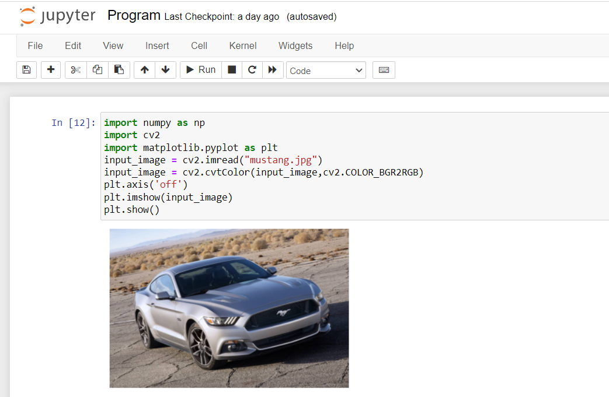
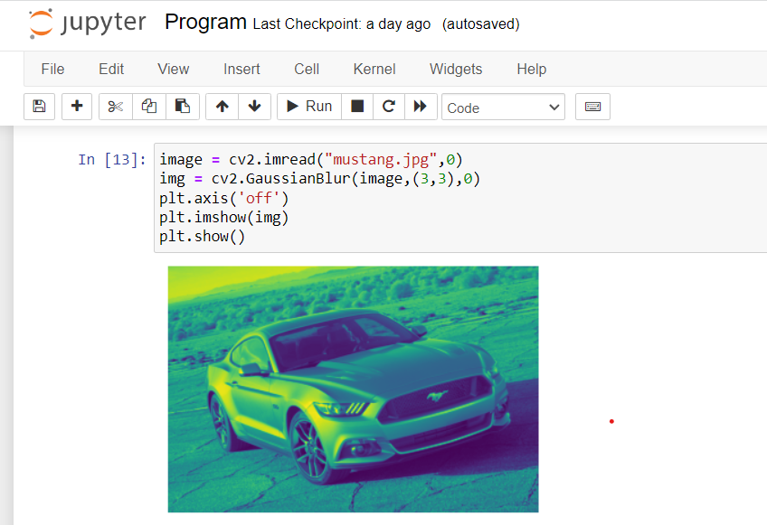
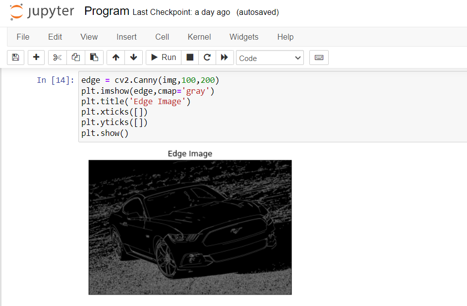
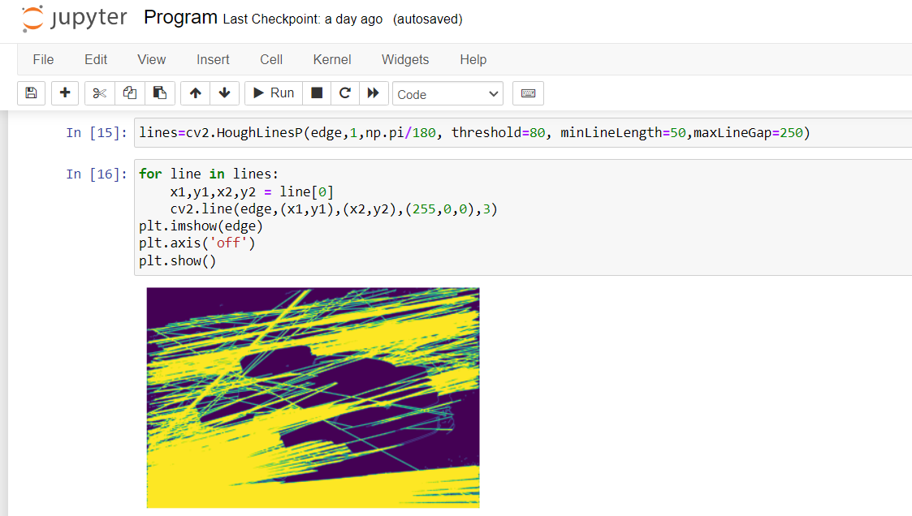

# Edge-Linking-using-Hough-Transform
## Aim:
To write a Python program to detect the lines using Hough Transform.

## Software Required:
Anaconda - Python 3.7

## Algorithm:
### Step1:
Import all the necessary modules for the program.

### Step 2:
Load a image using imread() from cv2 module.

### Step 3:
Convert the image to grayscale.

### Step 4:
Using Canny operator from cv2,detect the edges of the image

### Step 5:
Using the HoughLinesP(),detect line co-ordinates for every points in the images.Using For loop,draw the lines on the found co-ordinates.

### Step 6:
Display the image and end the program.

## Program:
Developed By: Shriram R

Register No: 212221240053

### 

### Read and display the input image
```Python
import numpy as np
import cv2
import matplotlib.pyplot as plt
input_image = cv2.imread("mustang.jpg")
input_image = cv2.cvtColor(input_image,cv2.COLOR_BGR2RGB)
plt.axis('off')
plt.imshow(input_image)
plt.show()
```

### Convert it to Grayscale image
```Python
image = cv2.imread("mustang.jpg",0)
img = cv2.GaussianBlur(image,(3,3),0)
plt.axis('off')
plt.imshow(img)
plt.show()
```
### Find the edges in the image using canny detector and display
```Python
lines=cv2.HoughLinesP(edge,1,np.pi/180, threshold=80, minLineLength=50,maxLineGap=250)
```


### Detect points that form a line using HoughLinesP
```Python
for line in lines:
    x1,y1,x2,y2 = line[0]
    cv2.line(edge,(x1,y1),(x2,y2),(255,0,0),3)
plt.imshow(edge)
plt.axis('off')
plt.show()

```
### Draw lines on the image and display
```Python
plt.imshow(edge)
plt.axis('off')
plt.show()


```
## Output
### Input image

### Grayscale image


### Canny Edge detector output




### Display the result of Hough transform



## Result:
Thus the program is written with python and OpenCV to detect lines using Hough transform. 
